# CoreHealthCare Data Pipeline Design

### Overview
This capstone project is designed to reinforce the understanding of the core components of an end-to-end data pipeline. The focus is on conceptualizing and designing a comprehensive data pipeline that addresses data ingestion, processing, storage, and analysis. The project challenges apply theoretical knowledge to a practical scenario without the need to build or code the actual pipeline.

In this project i show case my knowledge on the fundamental of data engineering and designing data pipeline system base on some scenerio.

## Tools Used
1. Canvas
2. Draw.io
3. Google Images

## 1. Home

## 2. Outline

## 3. Overview
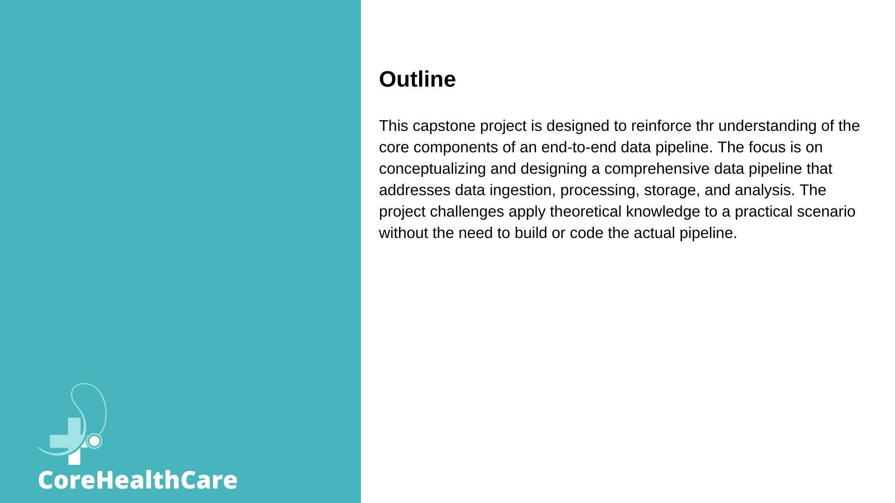

## 4. Problem Statement and Project Goal
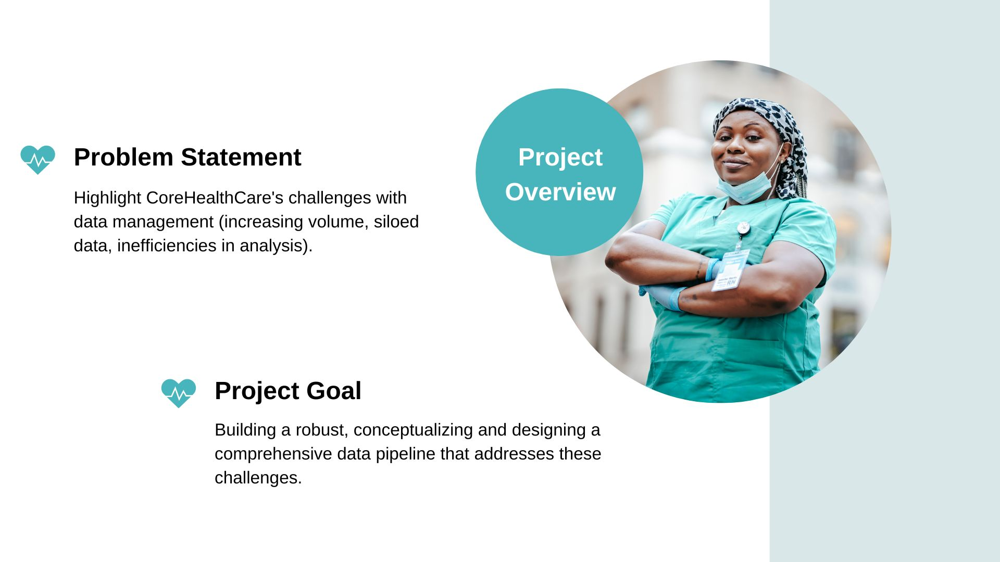

## 5. Current State
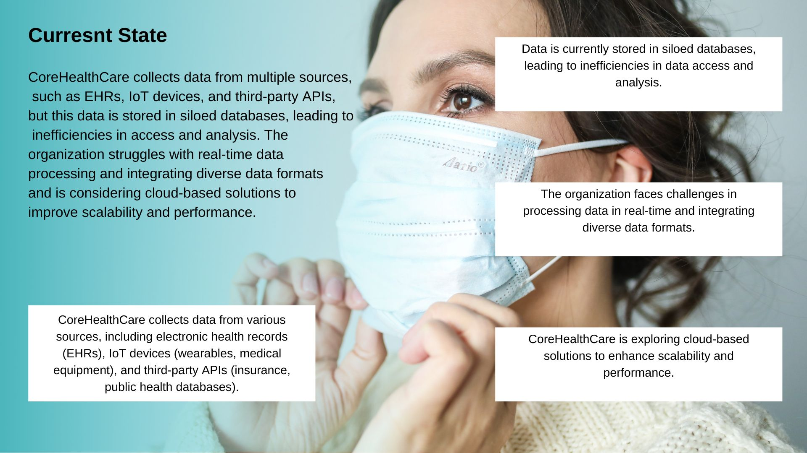

## 6. Data Ingestion Strategy
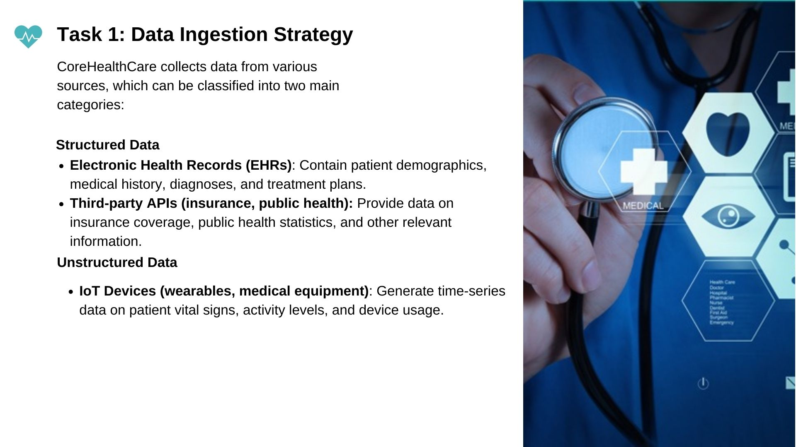

## 7. Data Ingestion Strategy (ctn'd)
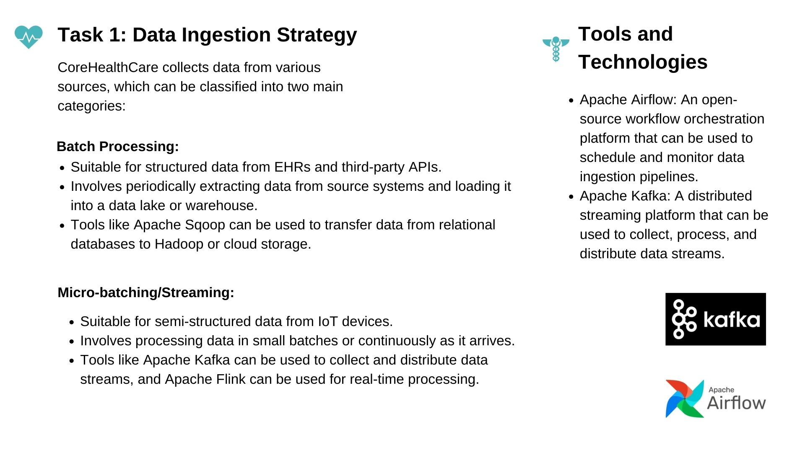

## 8. Data Ingestion Methods
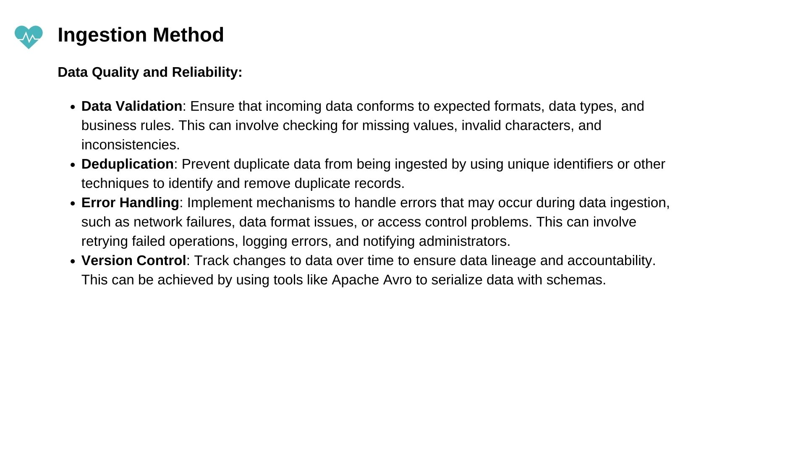

## 9. Data Preprocessing and Transformation
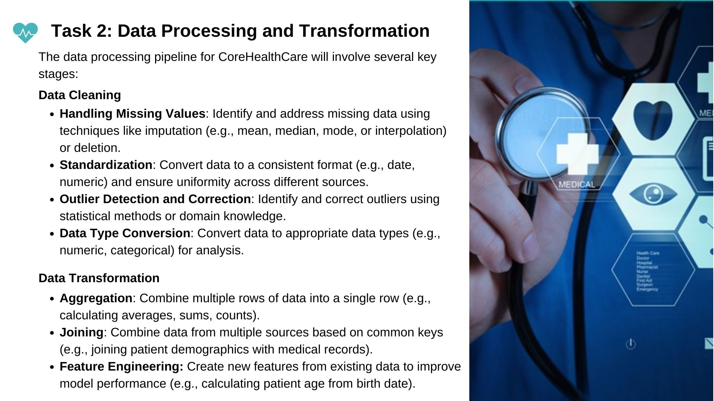

## 10. Data Preprocessing and Transformation (ctn'd)
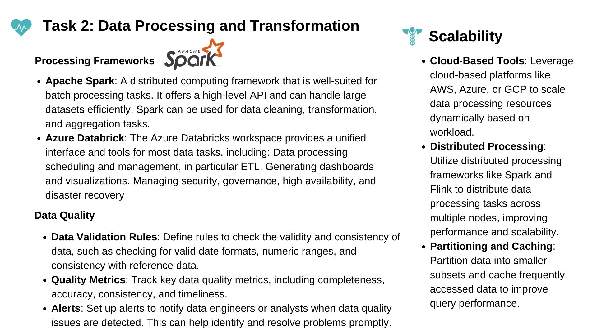

## 11. Data Preprocessing and Transformation (ctn'd)
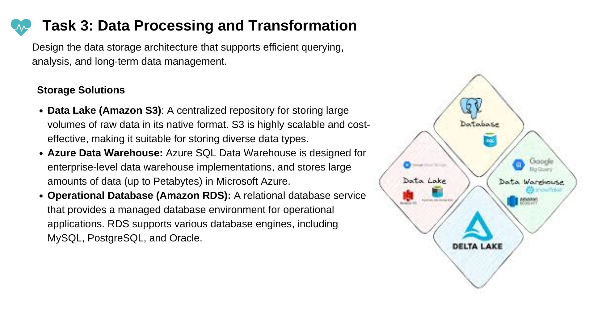

## 12. Data Storage Management 
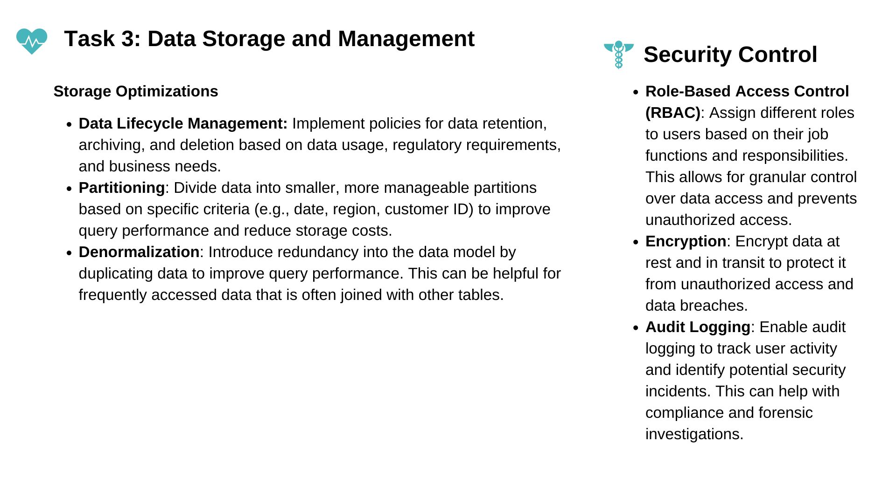

## 13. Pipeline Ochestration and Monitoring
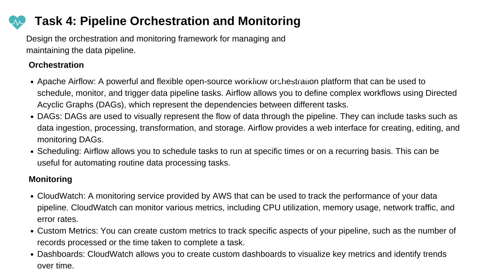

## 14. Pipeline Ochestration and Monitoring (ctn'd)
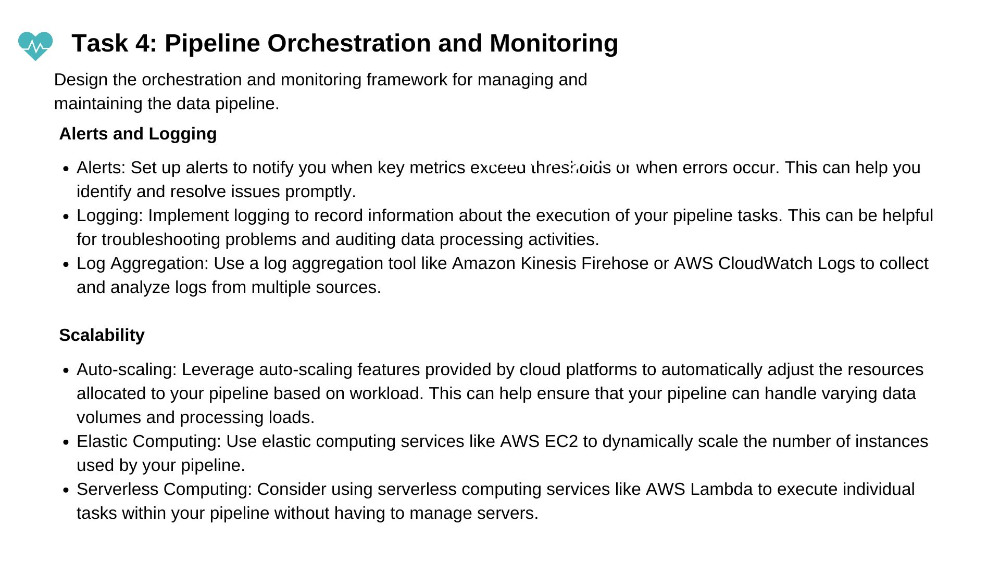

## 16. ETL Pipeline
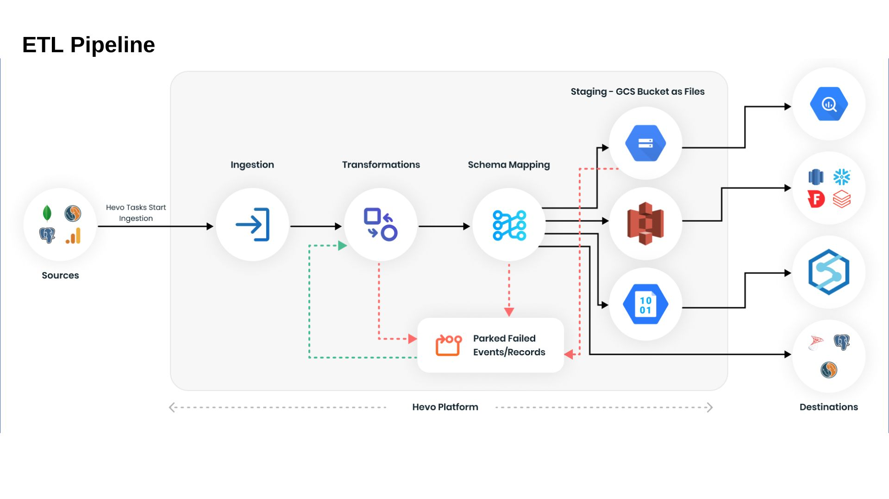

## 16. End-to-End Data Pipeline Architecture
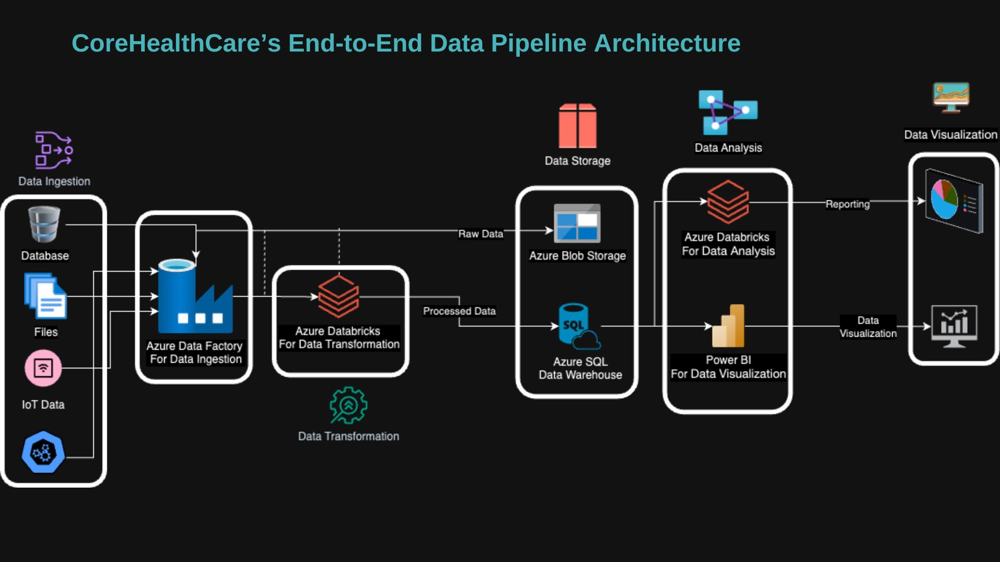

## 17. Thank you

