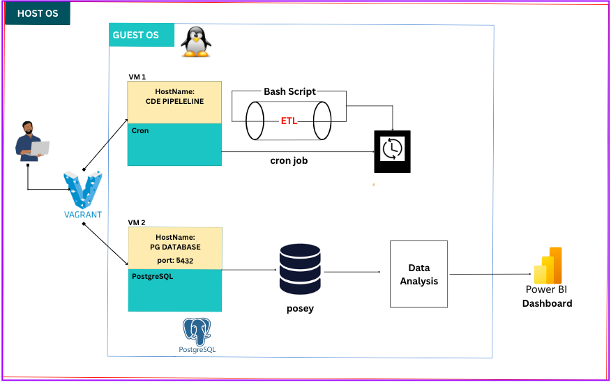

# SIMPLE ETL PIPELINE USING BASH SCRIPTING

## Overview
This project involves building a simple ETL Pipeline using `linux commands` and `bash scripting`. As a Data Engineer at CoreDataEngineer i was tasked with creating bash script that performs a simple ETL process on a given CSV file. The bash script is to download the CSV file from a source, perform a simple transformation and load the transformed data into a final directory.

In this project i showcased my knowledge on building a virtual development environment using the vagrant tool. I also display understanding of Linux commands and Bash Scripting as a data engineer.

## Tools Used
1. Vagrant
2. Oracle Virtial Box
3. Git (Version Control System)
4. Code Editor (any of your choice). My favorite is Visual Studio Code 😊.

## Task 1: Building a Virtual Environment
To get started i needed to build a `Linux` development environment for my project using the Vagrant tool. Building a development environment for my ETL process as a Data Engineer provides significant benefits in terms of consistency, portability, and ease of setup. It is particularly valuable in collaborative environments where reproducibility and isolation are crucial. For me it's enssential because i will love my ETL process to be run a linux (Ubuntu server) manchine.

### Vagrant Installation
The first thing is to get the Oracle Virtual Machine and  installed on your machine in no specific order. Once done with installation ensure you could confirm both insatallation on your computer via Terminal/CMD/git-bash or any preferred cmmand-line tool.

Once that is done i needed to create a `Vagrantfile` in my root directory. The Vagrantfile contains my configuration and setup of 2 Virtual Manchine: one to run my ETL pipeline and the other the run my postgreSQL database.

My Vagrant configuration file was sets up using two distinct virtual machines (VMs) on `Ubuntu 20.04 LTS (ubuntu/focal64)`. The first VM is configure to run the ELT process.

    # etl_pipeline service
    config.vm.define "etl_pipeline" do |etl_pipeline|
        etl_pipeline.vm.box = "ubuntu/focal64"
        etl_pipeline.vm.hostname = "cdepipeline"
        etl_pipeline.vm.provider "virtualbox" do |vb|
            vb.gui = false
            vb.memory = "1024"
            vb.cpus = 1
        end
        
        etl_pipeline.vm.synced_folder ".", "/vagrant", type: "rsync", rsync__exclude: ['.git/']
    #   etl.vm.provision "shell", path: "./provision/setup_cron_with_job.sh"
    end

  
* ETL Pipeline VM (etl_pipeline):
    * **Purpose**: This VM is designed to handle the ETL (Extract, Transform, Load) processes required for data engineering tasks.
    * **Configuration**:
        * Hostname: `cdepipeline`.
        * Resource Allocation: The VM is allocated 1 CPU and 1024 MB of memory, optimized for running lightweight ETL processes.
        * Synced Folder: The current working directory on the host is synchronized with the /vagrant directory on the VM. The synchronization excludes the `.git/` directory, ensuring that version control files are not unnecessarily copied.
        * Shell Provisioning: The provisioning script `(setup_cron_with_job.sh)` would typically automate the scheduling of ETL scripts within the VM. It installed cron and scheduled my ELT scripts to run daily at 12:00 AM

## Task 2: Building an ETL Script
Now, that the VM is set up i built a bash script `etl_scripts` that automate the Extract, Transform, and Load (ETL) process for financial data. The pipeline performs the following steps:

1. Download a CSV file from a specified URL.
2. Transform the data by extracting specific columns and renaming headers.
3. Load the transformed data into a designated directory.

### Requirements
* **Bash**: The script is written in Bash, so it requires a Unix-based system with a Bash shell.
* **wget or curl**: Either wget or curl must be installed to download the data. But if none id found the script will install one.

### Environment Variables
The script requires a .env file to load environment variables. The variable `URL`: The URL of the CSV file to be downloaded.

### Directory Structure
The project uses the following directory structure:
* `raw/`: Stores the raw CSV file downloaded from the URL.
* `transformed/`: Stores the transformed CSV file with selected columns.
* `Gold/`: Stores the final CSV file after transformation, ready for further use.

The script includes error handling to manage issues such as:

* Invalid or missing URLs
* Missing tools (`wget` or `curl`).
* Failure to download or save files.

Aside that the `Vagrantfile` configure the VM machine, it also schedule the `etl_scripts.sh` to run daily using cron jobs every day at 12:00 AM.

    CRON_JOB="0 0 * * * /bin/bash $SCRIPT_TO_RUN"

## Task 3: File Mover Script.
The next task is to build a simple bash script that helps to filter all CSV and JSON file in a particular directory `source directory` and move it to a final directory `destination directory`.

My bash scripting `file_mover.sh` expected the user to provide two arguement before execution:

* SOURCE_DIR: source directory
* TARGET_DIR: destination directory 

if the provided directory are valid the script move all CSV and JSON file from the `SOURCE_DIR` into the `TARGET_DIR`.

### Usage
Change the permission of the file to execution mode.

    chmod 775 file_mover.sh

To execute the file, run the command

    ./file_mover <source_directory> <destination_directory>

Example: 
    
    ./file_mover.sh ./path/to/source_dir ./path/to/destination_dir"

## Task 5: Parch and Posey Postgress Database.
The next task is to write a bash script that iterates over and copies each of the CSV files into a PostgreSQL database named `posey`.

For this part of the project i need to create a diffierent `VM` to setup my postgres database using vagrant, which make the second VM within my Vagrantfile.

    # postgresql service
    config.vm.define "pg_database" do |pg_database|
        pg_database.vm.box = "ubuntu/focal64"
        pg_database.vm.hostname = "cdedatabase"
        pg_database.vm.network "forwarded_port", guest: 5432, host: 5432, protocol: "tcp", host_ip: "127.0.0.1", auto_correct: true
        pg_database.vm.usable_port_range = 8000..8999
        pg_database.vm.network :private_network, ip: "192.168.56.4" 

        
        # Sync folder with CSV files from host to guest
        pg_database.vm.synced_folder "./parch_and_posey/data", "/vagrant_data"
      
        pg_database.vm.provider "virtualbox" do |vbox|
            vbox.memory = 2048
            vbox.cpus = 1
        end
        
        pg_database.vm.provision "shell", path: "./provision/database_provisioning.sh"
    end

This part of the `Vagrantfile` define the second VM to configure and setup the PostgresSQL Service.

* PostgreSQL Service VM (pg_database):

    * **Purpose**: This VM is dedicated to hosting the PostgreSQL database that the ETL pipeline will interact with.
    * **Configuration**:
    * **Hostname:  `cdedatabase`.
    * **Network Configuration**:
        * Port Forwarding: The PostgreSQL port `(5432)` on the VM is forwarded to the same port on the host machine. The auto_correct and host_ip settings ensure that the port is available and correctly routed.
        * Private Network: The VM is assigned a static IP address (192.168.56.4) on a private network, enabling isolated communication between VMs.
        * Resource Allocation: The VM is provisioned with 1 CPU and 2048 MB of memory, suitable for handling database operations.
        * Synced Folder: The directory `./parch_and_posey/data` on the host is synchronized with `/vagrant_data` on the VM, allowing access to necessary CSV files for database operations.
        * Provisioning: The VM is provisioned using a shell script `(database_provisioning.sh)`, which sets up the PostgreSQL database, users, and other necessary configurations.

    
# How to run this project on your Computer.
To get this awesome 🥰 project up and running on your local pc. You need to ensure you have the following tools installed and available.

1. Vagrant
2. Oracle Virtial Machine
3. Git (Version Control System)
4. Code Editor (any of your choice). My favorite is Visual Studio Code 😊.

## Clone the project

Clone this project to your preferred locationon your PC, using

    git clone 

**2. Start the Virtial Machine**
To run this project cd into the root directory of this project where you have the `Vagrantfile` and run the following vagrant commands from your terminal.

    vagrant up

The command above kick start and provision the two VM configure on our vagrantfile.

You can check the status of your VM, to ensure they are running.

    vagrant status

## Runinng the ELT Task
Once its done, we can now `ssh` into the machine to start interacting with our VM. To start interacting with the `cdepipeline` VM on which the ETL process is to take place. Enter the command into your terminal.

    vagrant ssh cdepipeline

Now, the cdepipeline VM is up and ready for interaction. All project folder on the Host OS is shared with your Guest OS via the folder_synched attribute of our vagrantfile configuration.

Now while in your GuestOS, you can confirm this synced folder by changing your directory to the etl_pipeline.

    cd /vagrant/etl_pipeline

then you should find the `etl_scripts.sh` file. To run the file change the permission to execution mode and run.

    chmod 775 etl.scripts.sh

then,

    ./etl_scripts.sh

Sit back an enjoy as the script performs an ETL process a given CSV.

## Runinng the File Mover Task
Now, for the file_mover, you can as change your directory to interact with the project.

    cd /vagrant/file_mover

In this directory you will find a script the peforming the task of filtering out CSV and JSON file from a source directory into a destination directory.

A default source directory `raw_data` and a destination directory `json_and_CSV` has been given. From your prefered code editor you could create your own custom source and destination directory with all kind of file type in the source directory. Never worry how the VM get this custom folders and files, they get synced automatically.

So to run this scripts that look into your source directory to find all CSV and JSON file and move them to a destination directory, run the following commands.

    chmod 775 file_mover.sh

To run:

    ./file_mover.sh ./path/to/source_dir ./path/to/destination_dir"

The two directory should be given as an positional arguements to the linux command.

Now we are done with the first VM, to exit out of the cdepipeline VM run the command.

    exit

and your are back into your Host OS terminal.

## Runinng the Parch and Posey Task

The next project is the Parch and Posey database. This database is configured the run on our second VM `pg_database`. The virtual machine was provision with a bash script `database_provisioning.sh` that set up the database by creating roles, set permissions and also create the neccessary tables.

    # Database credentials
    DB_NAME="$DB_NAME"
    DB_USER="$DB_USER"
    DB_PASSWORD="$DB_PASSWORD"
    DB_HOST="$DB_HOST"
    DB_PORT="$DB_PORT"

    # Set up PostgreSQL user and database
    echo "-------------------- creating postgres role with password --------------------"
    sudo -u postgres psql -c "CREATE ROLE $DB_USER WITH LOGIN PASSWORD '$DB_PASSWORD';"
    sudo -u postgres psql -c "ALTER ROLE $DB_USER WITH SUPERUSER;"
    sudo -u postgres psql -c "CREATE DATABASE $DB_NAME OWNER $DB_USER;"
    sudo -u postgres psql -c "GRANT ALL PRIVILEGES ON DATABASE $DB_NAME TO $DB_USER;"

    # Create necessary tables in the 'posey' database
    sudo -u postgres psql -d $DB_NAME -c "
        CREATE TABLE accounts (
        id integer NOT NULL,
        name character varying NOT NULL,
        website character varying,
        lat numeric,
        long numeric,
        primary_poc character varying,
        sales_rep_id integer
    );

    CREATE TABLE orders (
        id integer NOT NULL,
        account_id integer NOT NULL,
        occurred_at timestamp NOT NULL,
        standard_qty integer,
        gloss_qty integer,
        poster_qty integer,
        total integer,
        standard_amt_usd numeric,
        gloss_amt_usd numeric,
        poster_amt_usd numeric,
        total_amt_usd numeric
    );

    CREATE TABLE region (
        id integer NOT NULL,
        name character varying NOT NULL
    );

    CREATE TABLE sales_reps (
        id integer NOT NULL,
        name character varying NOT NULL,
        region_id integer NOT NULL
    );

    CREATE TABLE web_events (
        id integer NOT NULL,
        account_id integer NOT NULL,
        occurred_at timestamp NOT NULL,
        channel character varying NOT NULL
    );

To kick this VM too we need to ssh into the VM using the command below.

    vagrant ssh pg_database

Now we are in the Guest environment. Now change your directory:

    cd /vagrant/parch_and_posey

In this directory you will find you will find the bash script `pg_init.sh`. The script initalize our postgres database by reading through all the csb file in the `data` directory and load them into their respective tables.

## Performing Analysis on Parch and Posey Database

**Questions**
1. Find a list of order IDs where either gloss_qty or poster_qty is greater than 4000. Only include the id field in the resulting table.

        SELECT id
        FROM public.orders
        WHERE gloss_qty > 4000 OR poster_qty  >   4000;

2. Write a query that returns a list of orders where the standard_qty is zero and either the gloss_qty or poster_qty is over 1000.

        SELECT *
        FROM public.orders
        WHERE standard_qty = 0 AND (gloss_qty > 1000 OR poster_qty > 1000);

3. Find all the company names that start with a 'C' or 'W', and where the primary contact contains 'ana' or 'Ana', but does not contain 'eana'.

        SELECT *
        FROM public.region
        WHERE (name LIKE 'C%' OR name like 'W%') 
            AND (primary_poc LIKE '%ort%' OR primary_poc LIKE '%Ort%') 
            AND (primary_poc NOT LIKE '%eana%');

4. Provide a table that shows the region for each sales rep along with their associated accounts. Your final table should include three columns: the region name, the sales rep name, and the account name. Sort the accounts alphabetically (A-Z) by account name.

        SELECT r.name as region_name, 
               s.name as sales_rep_nam, 
               a.name as account_name
        FROM public.accounts AS a
        INNER JOIN public.sales_reps AS s ON a.sales_rep_id = s.id
        INNER JOIN public.region AS r ON s.region_id = r.id
        ORDER BY s.name ASC; 
